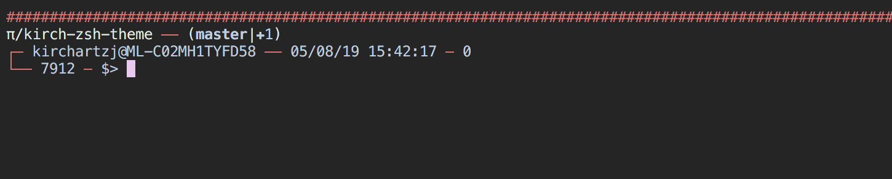

# kirch-zsh-theme

A simple zsh prompt theme.



## Requirements
Requires [zsh-git-prompt](https://github.com/leomeloxp/zsh-git-prompt)

## Install

With [zplug](https://github.com/zplug/zplug):

```sh
DEFAULT_USER='yourUser'
zplug "jkirchartz/kirch-zsh-theme", as:theme
```
